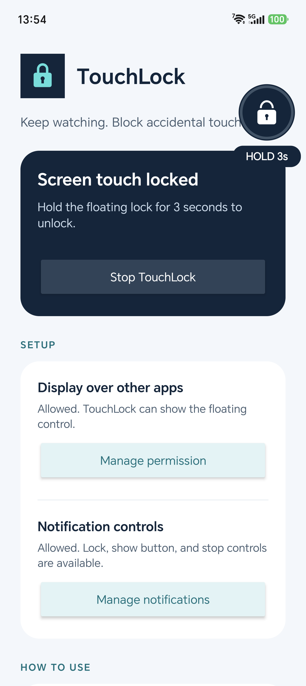

# TouchLock

**Let them watch the video call without tapping the screen.**

[Download the signed APK](https://github.com/yeeyon/touchlock/releases/latest) ? [Report a problem](https://github.com/yeeyon/touchlock/issues)

A small native Android app that blocks accidental taps and swipes over videos in WhatsApp and other apps. Kotlin, Android 8.0+ (API 26), targeting Android 15. No internet permission, accounts, analytics, accessibility service, screen recording, or access to other apps' content.

## Features

- Transparent blocking of app-area taps, swipes, and scrolling.
- Open padlock = ready; closed padlock = touch locked.
- Tap the floating control or **Lock screen touch** in the notification to lock.
- Hold still for **3 full seconds** to unlock, with a circular progress indicator.
- Drag the control in either state; dragging cancels unlocking.
- **Show button** in the notification restores the control to a visible position without unlocking.
- No accounts, ads, internet permission, analytics, Accessibility access, or screen recording.

## Install and use

Download and install `TouchLock-1.0.1.apk` from [Releases](https://github.com/yeeyon/touchlock/releases/latest). Android may ask you to allow installation from the app opening the APK.

1. Open TouchLock and grant **Display over other apps**. Return to TouchLock.
2. Allow notifications for the lock, show-button, and stop actions.
3. Tap **Enable floating lock**. Open a video in your preferred app.
4. The open padlock means ready. Tap it once or use **Lock screen touch** in the notification to block app-area touches. Drag the control to reposition it, even while locked.
5. Hold one finger on the lock for **3 full seconds** to unlock. The circular indicator shows progress. Early release, dragging, additional fingers, or interrupted input cancels the attempt. **Show button** in the notification brings the control back into view. The floating button remains available after unlocking.
6. Use **Stop TouchLock** in the notification or the app when finished. Turning the screen off also stops the service; enable it again after waking the phone.

System navigation, notification shade, power and volume buttons remain available. This is an accidental-touch blocker, not a kiosk or device lock. Apps that deliberately hide overlays can prevent TouchLock from appearing. Some manufacturers may restrict overlays or stop the service; check their app settings if needed. The published APK is release-signed for direct installation. It is not distributed through the Play Store.

For your child during a video call, the recommended personal-phone setup is **TouchLock plus PIN-protected screen pinning of the video-call app**. Pinning can restrict notification access, so retain the on-screen unlock control. [System gesture protection guide](docs/system-gesture-protection.md) explains the platform limits and the managed-device alternative. Video-call compatibility varies; test with your call app before relying on it.

## Screenshot



## Build

Install JDK 17 and the Android SDK with platform 35. Set `ANDROID_HOME` or put your SDK path in an ignored `local.properties` file (`sdk.dir=...`).

Windows:

```powershell
.\gradlew.bat :app:assembleDebug :app:testDebugUnitTest
```

macOS/Linux:

```sh
./gradlew :app:assembleDebug :app:testDebugUnitTest
```

The APK is generated at `app/build/outputs/apk/debug/app-debug.apk`.

### Release signing

Signing material is stored outside this repository. Create `~/.android/touchlock-release.properties` for your own signing key:

```properties
storeFile=/absolute/path/to/your-release.jks
storePassword=YOUR_STORE_PASSWORD
keyAlias=YOUR_KEY_ALIAS
keyPassword=YOUR_KEY_PASSWORD
```

Run `./gradlew :app:assembleRelease :app:testReleaseUnitTest` (Windows: `.\gradlew.bat`). Without these properties, the release APK is unsigned. Do not commit keys or password files. An APK signed with your own key cannot update the official APK in place.

### Device check

The signed release was installed on an Honor BKQ_N49 running Android 17 (API 37). App-area taps and swipes were blocked, a two-second hold stayed locked, and a full three-second hold restored the ready button. This is a device smoke check, not certification across all video-call apps or Android devices.

## Implementation

`MainActivity` handles setup and explicit user activation. `TouchLockService` owns a foreground service, a draggable `TYPE_APPLICATION_OVERLAY` control, and a transparent full-screen touch-consuming overlay. The windows use `FLAG_NOT_FOCUSABLE` to preserve the underlying app's focus, and never use `FLAG_NOT_TOUCHABLE`. Android 14+ uses the documented `specialUse` foreground-service type with its purpose declared in the manifest. No boot startup or automatic background restart is used.

`LockControlView` cancels queued animation callbacks when detached or cancelled. `HoldGesture` uses a monotonic clock and is unit-tested at the 2,999 ms / 3,000 ms boundary. Orientation changes reposition the control inside safe screen insets. Service shutdown removes both windows and the notification.

Android references: [overlay windows](https://developer.android.com/reference/android/view/WindowManager.LayoutParams#TYPE_APPLICATION_OVERLAY), [foreground-service types](https://developer.android.com/develop/background-work/services/fgs/service-types#special-use), [foreground-service launch rules](https://developer.android.com/develop/background-work/services/fgs/restrictions-bg-start).
